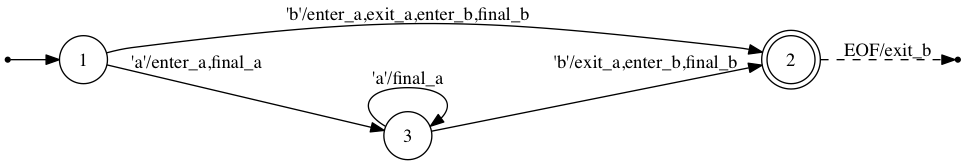

Home
====

Automa.jl is a package for generating [finite-state machines (FSMs)](<https://en.wikipedia.org/wiki/Finite-state_machine>) and [tokenizers](<https://en.wikipedia.org/wiki/Lexical_analysis>) in Julia.

The following code is an example of tokenizing various kinds of numeric literals in Julia.
```julia
using Automa
using Automa.RegExp
const re = Automa.RegExp

# Describe regular expression patterns.
int      = re"[-+]?[0-9]+"
hex      = re"0x[0-9A-Fa-f]+"
oct      = re"0o[0-7]+"
prefloat = re"[-+]?([0-9]+\.[0-9]*|[0-9]*\.[0-9]+)"
float    = prefloat | re.cat(prefloat | re"[-+]?[0-9]+", re"[eE][-+]?[0-9]+")
number   = int | hex | oct | float
spaces   = re.rep(re.space())
numbers  = re.cat(re.opt(spaces * number), re.rep(re.space() * spaces * number), spaces)

# Register action names to regular expressions.
number.actions[:enter] = [:mark]
int.actions[:exit]     = [:int]
hex.actions[:exit]     = [:hex]
oct.actions[:exit]     = [:oct]
float.actions[:exit]   = [:float]

# Compile a finite-state machine.
machine = compile(numbers)

#= This generates a SVG file to visualize the state machine.
write("numbers.dot", Automa.dfa2dot(machine.dfa))
run(`dot -Tsvg -o numbers.svg numbers.dot`)
=#

# Bind an action code for each action name.
actions = Dict(
    :mark  => :(mark = p),
    :int   => :(emit(:int)),
    :hex   => :(emit(:hex)),
    :oct   => :(emit(:oct)),
    :float => :(emit(:float)),
)

# Generate a tokenizing function from the machine.
@eval function tokenize(data::String)
    tokens = Tuple{Symbol,String}[]
    mark = 0
    $(generate_init_code(machine))
    p_end = p_eof = endof(data)
    emit(kind) = push!(tokens, (kind, data[mark:p-1]))
    $(generate_exec_code(machine, actions=actions))
    return tokens, cs ∈ $(machine.final_states) ? :ok : cs < 0 ? :error : :incomplete
end

tokens, status = tokenize("1 0x0123BEEF 0o754 3.14 1e-4 +6.022045e23")
```

Finally, space-separated numbers are tokenized as follows:
```jlcon
julia> tokens
6-element Array{Tuple{Symbol,String},1}:
 (:int,"1")
 (:hex,"0x0123BEEF")
 (:oct,"0o754")
 (:float,"3.14")
 (:float,"1e-4")
 (:float,"+6.022045e23")

julia> status
:ok

```


Overview
--------

Automa.jl is composed of three elements: regular expressions, compilers, and code generators. Regular expressions are used to specify patterns that you want to match and bind actions to. A regular expression can be built using APIs provided from the `Automa.RegExp` module. The regular expression with actions is then fed to a compiler function that creates a finite state machine and optimizes it to minimize the number of states. Finally, the machine object is used to generate Julia code that can be spliced into functions.

Machines are byte-oriented in a sense that input data fed into a machine is a sequence of bytes. The generated code of a machine reads input data byte by byte and updates a current state variable based on transition rules defined by regular expressions. If one or more actions are associated to a state transition they will be executed before reading a next byte. If no transition rule is found for a byte of a specific state the machine sets the current state to an error value, stops executing, and breaks from a loop.


Regular expressions
-------------------

Regular expressions in Automa.jl is somewhat more restricted than usual regular expressions in Julia. Some features like lookahead or backreference are not provided. In Automa.jl, `re"..."` is used instead of `r"..."` because these are different regular expressions. However, the syntax of Automa.jl's regular expressions is a subset of Julia's ones and hence it would be already familiar. Some examples are shown below:

```julia
decimal    = re"[-+]?[0-9]+"
keyword    = re"if|else|while|end"
identifier = re"[A-Za-z_][0-9A-Za-z_]*"
```

An important feature of regular expressions is composition of (sub-) regular expressions. One or more regular expressions can be composed using following functions:

| Function           | Alias  | Meaning                  |
| --------           | ------ | -------                  |
| `cat(re...)`       | `*`    | concatenation            |
| `alt(re1, re2...)` | `\|`   | alternation              |
| `rep(re)`          |        | zero or more repetition  |
| `rep1(re)`         |        | one or more repetition   |
| `opt(re)`          |        | zero or one repetition   |
| `isec(re1, re2)`   | `&`    | intersection             |
| `diff(re1, re2)`   | `\`    | difference (subtraction) |
| `neg(re)`          | `!`    | negation                 |

Actions can be bind to regular expressions. Currently, there are three kinds of actions: enter, exit, and final. Enter actions will be executed when it enters the regular expression. In contrast, exit actions will be executed when it exits from the regular expression. Final actions will be executed every time when it reaches a final (or accept) state. The following code and figure demonstrate transitions and actions between states.

```julia
using Automa
using Automa.RegExp
const re = Automa.RegExp

a = re"a*"
b = re"b"
ab = a * b

a.actions[:enter] = [:enter_a]
a.actions[:exit]  = [:exit_a]
a.actions[:final] = [:final_a]
b.actions[:enter] = [:enter_b]
b.actions[:exit]  = [:exit_b]
b.actions[:final] = [:final_b]
```



Compilers
---------

After finished defining a regular expression with optional actions you can compile it into a finite-state machine using the `compile` function. The `Machine` type is defined as follows:

```julia
type Machine
    states::UnitRange{Int}
    start_state::Int
    final_states::Set{Int}
    transitions::Dict{Int,Dict{UInt8,Tuple{Int,Vector{Symbol}}}}
    eof_actions::Dict{Int,Vector{Symbol}}
    dfa::DFA
end
```

For the purpose of debugging, Automa.jl offers the `execute` function, which emulates the machine execution and returns the last state with the action log. Let's execute a machine of `re"a*b"` with actions used in the previous example.
```jlcon
julia> machine = compile(ab)
Automa.Machine(<states=1:3,start_state=1,final_states=Set([0,2])>)

julia> Automa.execute(machine, "b")
(2,Symbol[:enter_a,:exit_a,:enter_b,:final_b,:exit_b])

julia> Automa.execute(machine, "ab")
(2,Symbol[:enter_a,:final_a,:exit_a,:enter_b,:final_b,:exit_b])

julia> Automa.execute(machine, "aab")
(2,Symbol[:enter_a,:final_a,:final_a,:exit_a,:enter_b,:final_b,:exit_b])

```

The `Tokenizer` type is also a useful tool built on top of `Machine`:

```julia
type Tokenizer
    machine::Machine
    actions_code::Vector{Tuple{Symbol,Expr}}
end
```

A tokenizer can be created using the `compile` function as well but the argument types are different. When defining a tokenizer, `compile` takes a list of pattern and action pairs as follows:
```julia
tokenizer = compile(
    re"if|else|while|end"      => :(emit(:keyword)),
    re"[A-Za-z_][0-9A-Za-z_]*" => :(emit(:identifier)),
    re"[0-9]+"                 => :(emit(:decimal)),
    re"="                      => :(emit(:assign)),
    re"("                      => :(emit(:lparen)),
    re")"                      => :(emit(:rparen)),
    re"[-+*/]"                 => :(emit(:operator)),
    re"[\n\t ]+"               => :(),
)
```

A tokenizer tries to find the longest token that is available from the current reading position. When multiple patterns match a substring of the same length, higher priority token placed at a former position in the arguments list will be selected. For example, `"else"` matches both `:keyword` and `:identifier` but the `:keyword` action will be run because it is placed before `:identifier` in the arguments list.

Code generators
---------------

Once a machine or a tokenizer is created it's ready to generate Julia code using metaprogramming techniques. 
Here is an example to count the number of words in a string:
```julia
using Automa
using Automa.RegExp
const re = Automa.RegExp

word = re"[A-Za-z]+"
words = re.cat(re.opt(word), re.rep(re" +" * word), re" *")

word.actions[:exit] = [:word]

machine = compile(words)

actions = Dict(:word => :(count += 1))

# Generate a function using @eval.
@eval function count_words(data)
    # initialize a result variable
    count = 0

    # generate code to initialize variables used by FSM
    $(generate_init_code(machine))

    # set end and EOF positions of data buffer
    p_end = p_eof = endof(data)

    # generate code to execute FSM
    $(generate_exec_code(machine, actions=actions))

    # check if FSM properly finished
    if cs != 0
        error("failed to count words")
    end

    return count
end
```

This will work as we expect:
```jlcon
julia> count_words("")
0

julia> count_words("The")
1

julia> count_words("The quick")
2

julia> count_words("The quick brown")
3

julia> count_words("The quick brown fox")
4

julia> count_words("A!")
ERROR: failed to count words
 in count_words(::String) at ./REPL[10]:16

```

We saw two kinds of functions to generate and splice Julia code into a function.

The first function is `generate_init_code`, which generates some code to declare and initialize local variables used by FSM.
```jlcon
julia> generate_init_code(machine)
quote  # /Users/kenta/.julia/v0.5/Automa/src/codegen.jl, line 13:
    p::Int = 1 # /Users/kenta/.julia/v0.5/Automa/src/codegen.jl, line 14:
    p_end::Int = 0 # /Users/kenta/.julia/v0.5/Automa/src/codegen.jl, line 15:
    p_eof::Int = -1 # /Users/kenta/.julia/v0.5/Automa/src/codegen.jl, line 16:
    cs::Int = 1
end

```

The input byte sequence is stored in the `data` variable, which, in this case, is passed as an argument. The variable `p` points at the next byte position in `data`. `p_end` points at the end position of data available in `data`. `p_eof` is similar to `p_end` but it points at the *actual* end of the input sequence. In the example above, `p_end` and `p_eof` are soon set to `sizeof(data)` because these two values can be determined immediately. `p_eof` would be undefined when `data` is too long to store in memory. In such a case, `p_eof` is set to a negative integer at the beginning and later set to a suitable position when the end of an input sequence is seen.

The second function is `generate_exec_code`, which generates a loop to emulate the FSM by updating `cs` (current state) while reading bytes from `data`. You don't need to care about the details of generated code because it is often too complicated to read for human. In short, the generated code tries to read as many bytes as possible from `data` and stops when it reaches `p_end` or when it fails transition.

After finished execution, the value stored in `cs` indicates whether the execution successfully finished or not. `cs == 0` means the FSM read all data and finished successfully. `cs < 0` means it failed somewhere. `cs > 0` means it is still in the middle of execution and needs more input data if any.
