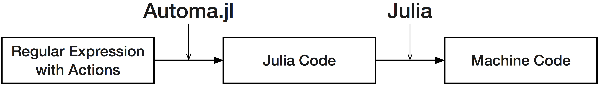

```@meta
CurrentModule = Automa
DocTestSetup = quote
    using TranscodingStreams
    using Automa
end
```

# Automa.jl
Automa is a regex-to-Julia compiler.
By compiling regex to Julia code in the form of `Expr` objects,
Automa provides facilities to create efficient and robust regex-based lexers, tokenizers and parsers using Julia's metaprogramming capabilities. 
You can view Automa as a regex engine that can insert arbitrary Julia code into its input matching process, which will be executed when certain parts of the regex matches an input.



Automa.jl is designed to generate very efficient code to scan large text data, which is often much faster than handcrafted code. 
Automa.jl is a regex engine that can insert arbitrary Julia code into its input matching process, that will be executed in when certain parts of the regex matches an input.

## Where to start
If you're not familiar with regex engines, start by reading the [theory section](theory.md),
then you might want to read every section from the top.
They're structured like a tutorial, beginning from the simplest use of Automa and moving to more advanced uses.

If you like to dive straight in, you might want to start by reading the examples below, then go through the examples in the `examples/` directory in the Automa repository.

## Examples
### Validate some text only is composed of ASCII alphanumeric characters
```jldoctest; output = false
generate_buffer_validator(:validate_alphanumeric, re"[a-zA-Z0-9]*") |> eval

for s in ["abc", "aU81m", "!,>"]
    println("$s is alphanumeric? $(isnothing(validate_alphanumeric(s)))")
end

# output
abc is alphanumeric? true
aU81m is alphanumeric? true
!,> is alphanumeric? false
```

### Making a lexer
```jldoctest; output = false
tokens = [
    :identifier => re"[A-Za-z_][0-9A-Za-z_!]*",
    :lparens => re"\(",
    :rparens => re"\)",
    :comma => re",",
    :quot => re"\"",
    :space => re"[\t\f ]+",
];
@eval @enum Token errortoken $(first.(tokens)...)
make_tokenizer((errortoken, 
    [Token(i) => j for (i,j) in enumerate(last.(tokens))]
)) |> eval

collect(tokenize(Token, """(alpha, "beta15")"""))

# output
8-element Vector{Tuple{Int64, Int32, Token}}:
 (1, 1, lparens)
 (2, 5, identifier)
 (7, 1, comma)
 (8, 1, space)
 (9, 1, quot)
 (10, 6, identifier)
 (16, 1, quot)
 (17, 1, rparens)
```

### Make a simple TSV file parser
```jldoctest; output = false
machine = let
    name = onexit!(onenter!(re"[^\t\r\n]+", :mark), :name)
    field = onexit!(onenter!(re"[^\t\r\n]+", :mark), :field)
    nameline = name * rep('\t' * name)
    record = onexit!(field * rep('\t' * field), :record)
    compile(nameline * re"\r?\n" * record * rep(re"\r?\n" * record) * rep(re"\r?\n"))
end

actions = Dict(
    :mark => :(pos = p),
    :name => :(push!(headers, String(data[pos:p-1]))),
    :field => quote
        n_fields += 1
        push!(fields, String(data[pos:p-1]))
    end,
    :record => quote
        n_fields == length(headers) || error("Malformed TSV")
        n_fields = 0
    end
)

@eval function parse_tsv(data)
    headers = String[]
    fields = String[]
    pos = n_fields = 0
    $(generate_code(machine, actions))
    (headers, reshape(fields, length(headers), :))
end

header, data = parse_tsv("a\tabc\n12\t13\r\nxyc\tz\n\n")

# output
(["a", "abc"], ["12" "xyc"; "13" "z"])
```
