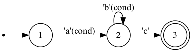

Automa.jl
=========

Overview
--------

Automa.jl is a package for generating [finite-state machines
(FSMs)](https://en.wikipedia.org/wiki/Finite-state_machine) and
[tokenizers](https://en.wikipedia.org/wiki/Lexical_analysis) in Julia.

The following code is an example of tokenizing various kinds of numeric literals in Julia.
```julia
import Automa
import Automa.RegExp: @re_str
const re = Automa.RegExp

# Describe patterns in regular expression.
oct      = re"0o[0-7]+"
dec      = re"[-+]?[0-9]+"
hex      = re"0x[0-9A-Fa-f]+"
prefloat = re"[-+]?([0-9]+\.[0-9]*|[0-9]*\.[0-9]+)"
float    = prefloat | re.cat(prefloat | re"[-+]?[0-9]+", re"[eE][-+]?[0-9]+")
number   = oct | dec | hex | float
numbers  = re.cat(re.opt(number), re.rep(re" +" * number), re" *")

# Register action names to regular expressions.
number.actions[:enter] = [:mark]
oct.actions[:exit]     = [:oct]
dec.actions[:exit]     = [:dec]
hex.actions[:exit]     = [:hex]
float.actions[:exit]   = [:float]

# Compile a finite-state machine.
machine = Automa.compile(numbers)

# This generates a SVG file to visualize the state machine.
# write("numbers.dot", Automa.machine2dot(machine))
# run(`dot -Tpng -o numbers.png numbers.dot`)

# Bind an action code for each action name.
actions = Dict(
    :mark  => :(mark = p),
    :oct   => :(emit(:oct)),
    :dec   => :(emit(:dec)),
    :hex   => :(emit(:hex)),
    :float => :(emit(:float)),
)

# Generate a tokenizing function from the machine.
context = Automa.CodeGenContext()
@eval function tokenize(data::String)
    tokens = Tuple{Symbol,String}[]
    mark = 0
    $(Automa.generate_init_code(context, machine))
    p_end = p_eof = lastindex(data)
    emit(kind) = push!(tokens, (kind, data[mark:p-1]))
    $(Automa.generate_exec_code(context, machine, actions))
    return tokens, cs == 0 ? :ok : cs < 0 ? :error : :incomplete
end

tokens, status = tokenize("1 0x0123BEEF 0o754 3.14 -1e4 +6.022045e23")
```

Finally, space-separated numbers are tokenized as follows:
```jlcon
julia> tokens
6-element Array{Tuple{Symbol,String},1}:
 (:dec,"1")
 (:hex,"0x0123BEEF")
 (:oct,"0o754")
 (:float,"3.14")
 (:float,"1e-4")
 (:float,"+6.022045e23")

julia> status
:ok

```


Automa.jl is composed of three elements: regular expressions, compilers, and code generators. Regular expressions are used to specify patterns that you want to match and bind actions to. A regular expression can be built using APIs provided from the `Automa.RegExp` module. The regular expression with actions is then fed to a compiler function that creates a finite state machine and optimizes it to minimize the number of states. Finally, the machine object is used to generate Julia code that can be spliced into functions.

Machines are byte-oriented in a sense that input data fed into a machine is a sequence of bytes. The generated code of a machine reads input data byte by byte and updates a current state variable based on transition rules defined by regular expressions. If one or more actions are associated to a state transition they will be executed before reading a next byte. If no transition rule is found for a byte of a specific state the machine sets the current state to an error value, stops executing, and breaks from a loop.


Regular expressions
-------------------

Regular expressions in Automa.jl is somewhat more restricted than usual regular expressions in Julia. Some features like lookahead or backreference are not provided. In Automa.jl, `re"..."` is used instead of `r"..."` because these are different regular expressions. However, the syntax of Automa.jl's regular expressions is a subset of Julia's ones and hence it would be already familiar. Some examples are shown below:

```julia
decimal    = re"[-+]?[0-9]+"
keyword    = re"if|else|while|end"
identifier = re"[A-Za-z_][0-9A-Za-z_]*"
```

An important feature of regular expressions is composition of (sub-) regular expressions. One or more regular expressions can be composed using following functions:

| Function           | Alias  | Meaning                  |
| --------           | ------ | -------                  |
| `cat(re...)`       | `*`    | concatenation            |
| `alt(re1, re2...)` | `\|`   | alternation              |
| `rep(re)`          |        | zero or more repetition  |
| `rep1(re)`         |        | one or more repetition   |
| `opt(re)`          |        | zero or one repetition   |
| `isec(re1, re2)`   | `&`    | intersection             |
| `diff(re1, re2)`   | `\`    | difference (subtraction) |
| `neg(re)`          | `!`    | negation                 |

Actions can be bind to regular expressions. Currently, there are four kinds of actions: enter, exit, :all and final. Enter actions will be executed when it enters the regular expression. In contrast, exit actions will be executed when it exits from the regular expression. All actions will be executed in all transitions and final actions will be executed every time when it reaches a final (or accept) state. The following code and figure demonstrate transitions and actions between states.

```julia
using Automa
using Automa.RegExp: @re_str
const re = Automa.RegExp

ab = re"ab*"
c = re"c"
pattern = re.cat(ab, c)

ab.actions[:enter] = [:enter_ab]
ab.actions[:exit]  = [:exit_ab]
ab.actions[:all]   = [:all_ab]
ab.actions[:final] = [:final_ab]
c.actions[:enter]  = [:enter_c]
c.actions[:exit]   = [:exit_c]
c.actions[:final]  = [:final_c]

write("actions.dot", Automa.machine2dot(Automa.compile(pattern)))
run(`dot -Tpng -o src/figure/actions.png actions.dot`)
```


Transitions can be conditioned by actions that return a boolean value. Assigning a name to the `when` field of a regular expression can bind an action to all transitions within the regular expression as the following example shows.

```julia
using Automa
using Automa.RegExp: @re_str
const re = Automa.RegExp

ab = re"ab*"
ab.when = :cond
c = re"c"
pattern = re.cat(ab, c)

write("preconditions.dot", Automa.machine2dot(Automa.compile(pattern)))
run(`dot -Tpng -o src/figure/preconditions.png preconditions.dot`)
```




Compilers
---------

After finished defining a regular expression with optional actions you can compile it into a finite-state machine using the `compile` function. The `Machine` type is defined as follows:

```julia
mutable struct Machine
    start::Node
    states::UnitRange{Int}
    start_state::Int
    final_states::Set{Int}
    eof_actions::Dict{Int,Set{Action}}
end
```

For the purpose of debugging, Automa.jl offers the `execute` function, which emulates the machine execution and returns the last state with the action log. Let's execute a machine of `re"a*b"` with actions used in the previous example.
```jlcon
julia> machine = Automa.compile(ab)
Automa.Machine(<states=1:3,start_state=1,final_states=Set([0,2])>)

julia> Automa.execute(machine, "b")
(2,Symbol[:enter_a,:exit_a,:enter_b,:final_b,:exit_b])

julia> Automa.execute(machine, "ab")
(2,Symbol[:enter_a,:final_a,:exit_a,:enter_b,:final_b,:exit_b])

julia> Automa.execute(machine, "aab")
(2,Symbol[:enter_a,:final_a,:final_a,:exit_a,:enter_b,:final_b,:exit_b])

```

The `Tokenizer` type is also a useful tool built on top of `Machine`:

```julia
mutable struct Tokenizer
    machine::Machine
    actions_code::Vector{Tuple{Symbol,Expr}}
end
```

A tokenizer can be created using the `compile` function as well but the
argument types are different. When defining a tokenizer, `compile` takes a list
of pattern and action pairs as follows:
```julia
tokenizer = Automa.compile(
    re"if|else|while|end"      => :(emit(:keyword)),
    re"[A-Za-z_][0-9A-Za-z_]*" => :(emit(:identifier)),
    re"[0-9]+"                 => :(emit(:decimal)),
    re"="                      => :(emit(:assign)),
    re"("                      => :(emit(:lparen)),
    re")"                      => :(emit(:rparen)),
    re"[-+*/]"                 => :(emit(:operator)),
    re"[\n\t ]+"               => :(),
)
```

The order of arguments is used to resolve ambiguity of pattern matching. A
tokenizer tries to find the longest token that is available from the current
reading position. When multiple patterns match a substring of the same length,
higher priority token placed at a former position in the arguments list will be
selected. For example, `"else"` matches both `:keyword` and `:identifier` but
the `:keyword` action will be run because it is placed before `:identifier` in
the arguments list.

Once a pattern is determined, the start and end positions of the token
substring can be accessed via `ts` and `te` local variables in the action code.
Other special variables (i.e. `p`, `p_end`, `p_eof` and `cs`) will be explained
in the following section. See example/tokenizer.jl for a complete example.


Code generators
---------------

Once a machine or a tokenizer is created it's ready to generate Julia code using metaprogramming techniques. 
Here is an example to count the number of words in a string:
```julia
import Automa
import Automa.RegExp: @re_str
const re = Automa.RegExp

word = re"[A-Za-z]+"
words = re.cat(re.opt(word), re.rep(re" +" * word), re" *")

word.actions[:exit] = [:word]

machine = Automa.compile(words)

actions = Dict(:word => :(count += 1))

# Generate a function using @eval.
context = Automa.CodeGenContext()
@eval function count_words(data)
    # initialize a result variable
    count = 0

    # generate code to initialize variables used by FSM
    $(Automa.generate_init_code(context, machine))

    # set end and EOF positions of data buffer
    p_end = p_eof = lastindex(data)

    # generate code to execute FSM
    $(Automa.generate_exec_code(context, machine, actions))

    # check if FSM properly finished
    if cs != 0
        error("failed to count words")
    end

    return count
end
```

This will work as we expect:
```jlcon
julia> count_words("")
0

julia> count_words("The")
1

julia> count_words("The quick")
2

julia> count_words("The quick brown")
3

julia> count_words("The quick brown fox")
4

julia> count_words("A!")
ERROR: failed to count words
 in count_words(::String) at ./REPL[10]:16

```

There are two code-generating functions: `generate_init_code` and
`generate_exec_code`. Both of them take a `CodeGenContext` object as the first
argument and a `Machine` object as the second. The `generate_init_code`
generates variable declatarions used by the finite state machine (FSM). 

```jlcon
julia> Automa.generate_init_code(context, machine)
quote  # /Users/kenta/.julia/v0.6/Automa/src/codegen.jl, line 67:
    p::Int = 1 # /Users/kenta/.julia/v0.6/Automa/src/codegen.jl, line 68:
    p_end::Int = 0 # /Users/kenta/.julia/v0.6/Automa/src/codegen.jl, line 69:
    p_eof::Int = -1 # /Users/kenta/.julia/v0.6/Automa/src/codegen.jl, line 70:
    cs::Int = 1
end

```

The input byte sequence is stored in the `data` variable, which, in this case,
is passed as an argument. The `data` object must support `Automa.pointerstart`
and `Automa.pointerend` methods. These point to the start and end memory
positions, respectively. There are default implementations for these methods,
which depend on `Base.pointer` and `Base.sizeof` methods. So, if `data` is a
`Vector{UInt8}` or a `String` object, there is no need to implement them. But if
you want to use your own type, you need to support them.

The variable `p` points at the next byte position in `data`. `p_end` points at
the end position of data available in `data`. `p_eof` is similar to `p_end` but
it points at the *actual* end of the input sequence. In the example above,
`p_end` and `p_eof` are soon set to `sizeof(data)` because these two values can
be determined immediately.  `p_eof` would be undefined when `data` is too long
to store in memory. In such a case, `p_eof` is set to a negative integer at the
beginning and later set to a suitable position when the end of an input sequence
is seen. The `cs` variable stores the current state of a machine.

The `generate_exec_code` generates code that emulates the FSM execution by
updating `cs` (current state) while reading bytes from `data`. You don't need to
care about the details of generated code because it is often too complicated to
read for human. In short, the generated code tries to read as many bytes as
possible from `data` and stops when it reaches `p_end` or when it fails
transition.

```jlcon
julia> Automa.generate_exec_code(context, machine, actions)
quote  # /Users/kenta/.julia/v0.6/Automa/src/codegen.jl, line 116:
    ##659 = (Automa.SizedMemory)(data) # /Users/kenta/.julia/v0.6/Automa/src/codegen.jl, line 117:
    while p ≤ p_end && cs > 0 # /Users/kenta/.julia/v0.6/Automa/src/codegen.jl, line 118:
        ##660 = (getindex)(##659, p) # /Users/kenta/.julia/v0.6/Automa/src/codegen.jl, line 119:
        @inbounds ##661 = ([0 0; 0 0; … ; 0 0; 0 0])[(cs - 1) << 8 + ##660 + 1] # /Users/kenta/.julia/v0.6/Automa/src/codegen.jl, line 120:
        @inbounds cs = ([-1 -2; -1 -2; … ; -1 -2; -1 -2])[(cs - 1) << 8 + ##660 + 1] # /Users/kenta/.julia/v0.6/Automa/src/codegen.jl, line 121:
        if ##661 == 1
            count += 1
        else
            ()
        end # /Users/kenta/.julia/v0.6/Automa/src/codegen.jl, line 122:
        p += 1
    end # /Users/kenta/.julia/v0.6/Automa/src/codegen.jl, line 124:
    if p > p_eof ≥ 0 && cs ∈ Set([2, 1]) # /Users/kenta/.julia/v0.6/Automa/src/codegen.jl, line 125:
        if cs == 2
            count += 1
        else
            if cs == 1
            else
                ()
            end
        end # /Users/kenta/.julia/v0.6/Automa/src/codegen.jl, line 126:
        cs = 0
    else  # /Users/kenta/.julia/v0.6/Automa/src/codegen.jl, line 127:
        if cs < 0 # /Users/kenta/.julia/v0.6/Automa/src/codegen.jl, line 128:
            p -= 1
        end
    end
end

```

After finished execution, the value stored in `cs` indicates whether the execution successfully finished or not. `cs == 0` means the FSM read all data and finished successfully. `cs < 0` means it failed somewhere. `cs > 0` means it is still in the middle of execution and needs more input data if any. The following snippet is a pseudocode of the machine execution:

```
# start main loop
while p ≤ p_end && cs > 0
    l = {{ read a byte of `data` at position `p` }}
    if {{ transferable from `cs` with `l` }}
        cs = {{ next state of `cs` with `l` }}
        {{ execute actions if any }}
    else
        cs = -cs
    end
    p += 1  # increment the position variable
end

if p_eof ≥ 0 && p > p_eof && cs ∈ machine.final_states
    {{ execute EOF actions if any }}
    cs = 0
elseif cs < 0
    p -= 1  # point at the last read byte
end
```

Automa.jl has three kinds of code generators. The first and default one uses two lookup tables to pick up the next state and the actions for the current state and input. The second one expands these lookup tables into a series of if-else branches. The third one is based on `@goto` jumps. These three code generators are named as `:table`, `:inline`, and `:goto`, respectively. To sepcify a code generator, you can pass the `code=:table|:inline|:goto` argument to `Automa.generate_exec_code`. The generated code size and its runtime speed highly depends on the machine and actions. However, as a rule of thumb, the code size and the runtime speed follow this order (i.e. `:table` will generates the smallest but the slowest code while `:goto` will the largest but the fastest). Also, specifying `check=false` turns off bounds checking while executing and often improves the runtime performance slightly.
