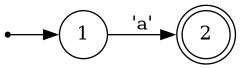
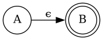

# Theory of regular expressions
Most programmers are familiar with _regular expressions_, or _regex_, for short.
What many programmers don't know is that regex have a deep theoretical underpinning, which is leaned on by regex engines to produce highly efficient code.

Informally, a regular expression can be thought of as any pattern that can be constructed from the following atoms:
* The empty string is a valid regular expression, i.e. `re""`
* Literal matching of a single symbol from a finite alphabet, such as a character, i.e. `re"p"`

Atoms can be combined with the following operations, if R and P are two regular expressions:
* Alternation, i.e `R | P`, meaning either match R or P.
* Concatenation, i.e. `R * P`, meaning match first R, then P
* Repetition, i.e. `R*`, meaning match R zero or more times consecutively.

!!! note 
    In Automa, the alphabet is _bytes_, i.e. `0x00:0xff`, and so each symbol is a single byte.
    Multi-byte characters such as `Æ` is interpreted as the two concatenated of two symbols,
    `re"\xc3" * re"\x86"`.
    The fact that Automa considers one input to be one byte, not one character, can become relevant if you instruct Automa to complete an action "on every input".

Popular regex libraries include more operations like `?` and `+`.
These can trivially be constructed from the above mentioned primitives,
i.e. `R?` is `"" | R`,
and `R+` is `RR*`.

Some implementations of regular expression engines, such as PCRE which is the default in Julia as of Julia 1.8,
also support operations like backreferences and lookbehind.
These operations can NOT be constructed from the above atoms and axioms, meaning that PCRE expressions are not regular expressions in the theoretical sense.

The practical importance of theoretically sound regular expressions is that there exists algorithms that can match regular expressions on O(N) time and O(1) space,
whereas this is not true for PCRE expressions, which are therefore significantly slower.

!!! note 
    Automa.jl only supports real regex, and as such does not support e.g. backreferences,
    in order to gurantee fast runtime performance.

To match regex to strings, the regex are transformed to _finite automata_, which are then implemented in code.

## Nondeterministic finite automata
The programmer Ken Thompson, of Unix fame, deviced _Thompson's construction_, an algorithm to constuct a nondeterministic finite automaton (NFA) from a regex.
An NFA can be thought of as a flowchart (or a directed graph), where one can move from node to node on directed edges.
Edges are either labeled `ϵ`, in which the machine can freely move through the edge to its destination node,
or labeled with one or more input symbols, in which the machine may traverse the edge upon consuming said input.

To illustrate, let's look at one of the simplest regex: `re"a"`, matching the letter `a`:

You begin at the small dot on the right, then immediately go to state 1, the circle marked by a `1`.
By moving to the next state, state 2, you consume the next symbol from the input string, which must be the symbol marked on the edge from state 1 to state 2 (in this case, an `a`).
Some states are "accept states", illustrated by a double circle. If you are at an accept state when you've consumed all symbols of the input string, the string matches the regex.

Each of the operations that combine regex can also combine NFAs.
For example, given the two regex `a` and `b`, which correspond to the NFAs `A` and `B`, the regex `a * b` can be expressed with the following NFA:

Note the `ϵ` symbol on the edge - this signifies an "epsilon transition", meaning you move directly from `A` to `B` without consuming any symbols.

Similarly, `a | b` correspond to this NFA structure...

...and `a*` to this:

For a larger example, `re"(\+|-)?(0|1)*"` combines alternation, concatenation and repetition and so looks like this:

ϵ-transitions means that there are states from which there are multiple possible next states, e.g. in the larger example above, state 1 can lead to state 2 or state 8.
That's what makes NFAs nondeterministic.

In order to match a regex to a string then, the movement through the NFA must be emulated.
You begin at state 1. When a non-ϵ edge is encountered, you consume a byte of the input data if it matches.
If there are no edges that match your input, the string does not match.
If an ϵ-edge is encountered from state `A` that leads to states `B` and `C`, the machine goes from state `A` to state `{B, C}`, i.e. in both states at once.

For example, if the regex `re"(\+|-)?(0|1)*` visualized above is matched to the string `-11`, this is what happens:
* NFA starts in state 1
* NFA immediately moves to all states reachable via ϵ transition. It is now in state {2, 3, 5, 7, 8, 9, 10}.
* NFA sees input `-`. States {2, 3, 4, 5, 7, 8, 10} do not have an edge with `-` leading out, so these states die.
  Therefore, the machine is in state 9, consumes the input, and moves to state 2.
* NFA immediately moves to all states reachable from state 2 via ϵ transitions, so goes to {3, 4, 5, 7}
* NFA sees input `1`, must be in state 5, moves to state 6, then through ϵ transitions to state {3, 4, 5, 7}
* The above point repeats, NFA is still in state {3, 4, 5, 7}
* Input ends. Since state 3 is an accept state, the string matches.

Using only a regex-to-NFA converter, you could create a simple regex engine simply by emulating the NFA as above.
The existence of ϵ transitions means the NFA can be in multiple states at once which adds unwelcome complexity to the emulation and makes it slower.
Luckily, every NFA has an equivalent _determinisitic finite automaton_, which can be constructed from the NFA using the so-called _powerset construction_.

## Deterministic finite automata
Or DFAs, as they are called, are similar to NFAs, but do not contain ϵ-edges.
This means that a given input string has either zero paths (if it does not match the regex), one, unambiguous path, through the DFA.
In other words, every input symbol _must_ trigger one unambiguous state transition from one state to one other state.

Let's visualize the DFA equivalent to the larger NFA above:

It might not be obvious, but the DFA above accepts exactly the same inputs as the previous NFA.
DFAs are way simpler to simulate in code than NFAs, precisely because at every state, for every input, there is exactly one action.
DFAs can be simulated either using a lookup table of possible state transitions,
or by hardcoding GOTO-statements from node to node when the correct input is matched.
Code simulating DFAs can be ridicuously fast, with each state transition taking less than 1 nanosecond, if implemented well.

Furthermore, DFAs can be optimised.
Two edges between the same nodes with labels `A` and `B` can be collapsed to a single edge with labels `[AB]`, and redundant nodes can be collapsed.
The optimised DFA equivalent to the one above is simply: 

Unfortunately, as the name "powerset construction" hints, convering an NFA with N nodes may result in a DFA with up to 2^N nodes.
This inconvenient fact drives important design decisions in regex implementations.
There are basically two approaches:

Automa.jl will just construct the DFA directly, and accept a worst-case complexity of O(2^N).
This is acceptable (I think) for Automa, because this construction happens in Julia's package precompilation stage (not on package loading or usage),
and because the DFAs are assumed to be constants within a package.
So, if a developer accidentally writes an NFA which is unacceptably slow to convert to a DFA, it will be caught in development.
Luckily, it's pretty rare to have NFAs that result in truly abysmally slow conversions to DFA's:
While bad corner cases exist, they are rarely as catastrophic as the O(2^N) would suggest.
Currently, Automa's regex/NFA/DFA compilation pipeline is very slow and unoptimized, but, since it happens during precompile time, it is insignificant compared to LLVM compile times.

Other implementations, like the popular `ripgrep` command line tool, uses an adaptive approach.
It constructs the DFA on the fly, as each symbol is being matched, and then caches the DFA.
If the DFA size grows too large, the cache is flushed.
If the cache is flushed too often, it falls back to simulating the NFA directly.
Such an approach is necessary for `ripgrep`, because the regex -> NFA -> DFA compilation happens at runtime and must be near-instantaneous, unlike Automa, where it happens during package precompilation and can afford to be slow.

## Automa in a nutshell
Automa simulates the DFA by having the DFA create a Julia `Expr`, which is then used to generate a Julia function using metaprogramming.
Like all other Julia code, this function is then optimized by Julia and then LLVM, making the DFA simulations very fast.

Because Automa just constructs Julia functions, we can do extra tricks that ordinary regex engines cannot:
We can splice arbitrary Julia code into the DFA simulation.
Currently, Automa supports two such kinds of code: _actions_, and _preconditions_.

Actions are Julia code that is executed during certain state transitions.
Preconditions are Julia code, that evaluates to a `Bool` value, and which are checked before a state transition.
If a precondition evaluates to `false`, the transition is not taken.
